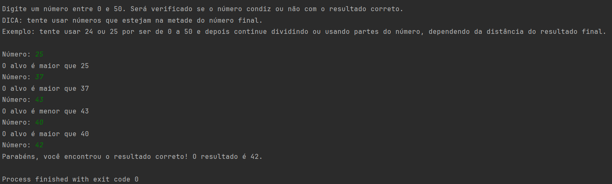

# Busca Binária

## Sumário

- [Descrição](#Descrição)
- [Instalação](#Instalação)
- [Como usar](#Como-usar)
- [Contribuição](#Contribuição)

## Descrição

Esse projeto é uma aplicação java simples que implementa uma busca binária onde o usuário deve adivinhar um número dentro da array de 0 a 50. A aplicação informa se o número condiz ou não com o alvo correto. Além disso, o programa diz se o chute foi maior ou menos do que o alvo correto. A cada execução, um alvo específico é escolhido pelo método Math.random.

## Instalação

1. Clone o repositório: 

    ```bash
        git clone https://github.com/DG-Danieldev/BuscaBinaria.git
   
2. Navegue até o diretório do projeto:
   
    ```bash
        cd BuscaBinaria
   
3. Se necessário, compile o código:

    ```bash
        javac BuscaBinaria.java

## Como usar

1. Para executar, use o seguinte comando:

    ```bash
        java BuscaBinaria

2. Leia a saída e digite um valor numérico inteiro de entrada.

Exemplo:



## Contribuição

Se você quiser contribuir, por favor, crie uma branch a partir da 'main', faça suas alterações e abra um Pull Request.